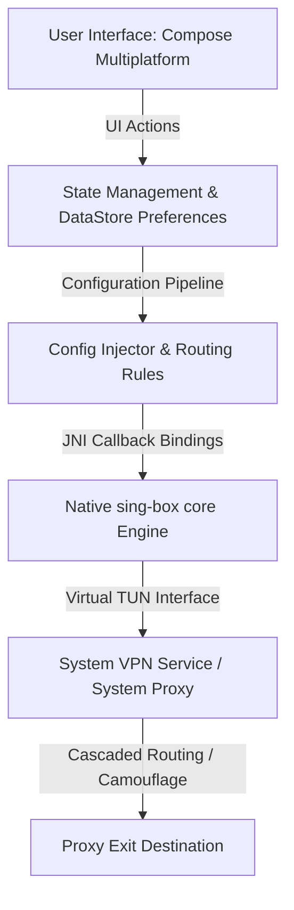

# کامیلیون (Chameleon)

[](#مشخصات-فنی)
[](https://github.com/SagerNet/sing-box)
[](#قابلیت‌های-کلیدی)
[](LICENSE)

پروژه **کامیلیون (Chameleon)** یک کلاینت VPN چندسکویی، امن، با کارایی بالا و رابط کاربری مدرن است که برای سیستم‌عامل‌های اندروید و دسکتاپ (JVM) توسعه یافته است. این برنامه با استفاده از **Jetpack Compose** و **Compose Multiplatform** ساخته شده و تجربه کاربری مدرن Material Design 3 را با قابلیت‌های مسیریابی چند پروتکله و کم‌تاخیرِ هسته قدرتمند `sing-box` (از طریق ارتباط JNI) تلفیق می‌کند.

---

## نمای کلی معماری

کامیلیون با تعبیه کردن هسته بومی `sing-box` (توسعه‌یافته با Go) به صورت مستقیم در پروژه‌های اندروید و دسکتاپ، منطق مسیریابی و پایپ‌لاین پیکربندی یکپارچه‌ای را در تمام پلتفرم‌ها ارائه می‌دهد.



* **لایه رابط کاربری (UI Layer)**: توسعه یافته با Compose Multiplatform جهت اشتراک‌گذاری چیدمان‌ها، پوسته و استیت‌های رابط کاربری بین ماژول‌های اندروید و دسکتاپ، به همراه اتصال‌های بومی به قابلیت‌های هر سیستم‌عامل (نظیر کاشی تنظیمات سریع اندروید یا آیکون System Tray دسکتاپ).
* **پایپ‌لاین پیکربندی (Configuration Pipeline)**: ترجیحات کاربر و اطلاعات اشتراک‌ها را به الگوهای JSON استاندارد و معتبر برای `sing-box` تبدیل کرده و تنظیمات کاربر را به صورت پویا در پیکربندی نهایی اعمال می‌کند.
* **هسته اصلی (Core Engine)**: از یک کتابخانه بومی Go استفاده می‌کند که به صورت باینری JNI کامپایل شده است؛ این ساختار اجازه می‌دهد فراخوانی‌های API به صورت مستقیم در سطح حافظه انجام شوند و نیازی به اجرای پردازش‌های پس‌زمینه جانبی (Subprocesses) نباشد که کارایی بالا و مدیریت مطمئن چرخه عمر سرویس را تضمین می‌کند.

---

## قابلیت‌های کلیدی

### 🎨 رابط کاربری مدرن Material 3 و میکرواینمیشن‌ها
* **طراحی گوشه‌های نامتقارن (Asymmetric Design)**: پیاده‌سازی اشکال ارگانیک و منحنی برای کارت‌ها و دکمه‌ها (`ExpressiveCardShape` و `ExpressiveButtonShape`) در بخش پیشخوان برنامه منطبق با آخرین دستورالعمل‌های Material 3.
* **بصری‌سازی با شتاب‌دهی گرافیکی (GPU-Accelerated)**: ویژوالایزر موجی و شاخص پیشرفت دایره‌ای موج‌دار (`CircularWavyProgressIndicator`) که پردازش آن‌ها به طور کامل روی GPU انجام می‌شود تا بار پردازشی اضافه از روی CPU برداشته شود.
* **نمایش زنده سرعت پهنای باند**: نمودار خطی و روان ترسیم پهنای باند دریافتی و ارسالی به صورت زنده بر روی یک بوم با منحنی‌های Cubic-Bezier.
* **همگام‌سازی پویا با رنگ سیستم**: انطباق خودکار تم رنگی نرم‌افزار با رنگ سیستم‌عامل (رنگ‌های داینامیک یا Monet در اندروید) یا پالت‌های رنگی شخصی‌سازی شده در نسخه دسکتاپ.

### ⛓️ زنجیره‌سازی پروکسی به صورت چند مرحله‌ای (Multi-Hop)
* **رابط بصری ساخت زنجیره (Visual Chain Builder)**: ساخت و ویرایش زنجیره‌های پروکسی به صورت کاملا بصری با کنترل پویای مسیرها جهت جلوگیری از ایجاد حلقه‌های مسیریابی خودکار (Circular-Routing).
* **رله کردن دو مرحله‌ای (Double-Hop Relaying)**: رمزگذاری و هدایت ترافیک به طور متوالی از طریق دو سرور پروکسی (دستگاه ➔ سرور میانی/رله ➔ سرور خروجی ➔ اینترنت) به منظور پنهان‌سازی آی‌پی اصلی کاربر از سرور نهایی.
* **مسیریابی بومی در هسته**: اعمال تنظیمات مسیرهای چند پرش به صورت مستقیم در داخل هسته `sing-box` با پارامتر `"detour"` برای به حداقل رساندن افت سرعت و تاخیر.

### 🕵️ استتار پیشرفته (Domain Fronting و اسکنر آی‌پی)
* **جعل و تغییر مشخصه دامنه (SNI Fronting)**: دور زدن فیلترینگ‌های مبتنی بر بررسی بسته‌ها (DPI) از طریق استتار ترافیک در قالب دامنه‌های مجاز و هدایت ترافیک به سمت آی‌پی تمیز لبه شبکه توزیع محتوا (CDN).
* **اسکنر موازی آی‌پی تمیز (Parallel Clean IP Scanner)**: اسکنر ناهمگام و همزمان شبکه (`CdnIpScanner`) با استفاده از پروب‌های TCP کوتاه‌مدت جهت یافتن سریع‌ترین آی‌پی‌های تمیز و بدون مسدودیت شبکه لبه CDN به صورت زنده.
* **پیش‌فرض‌های ابری (Cloud Presets)**: تنظیمات پیش‌فرض برای ارائه‌دهندگان مطرح ابری به همراه امکان بازنویسی دلخواه هدرهای Host.

### ⚡ مسیریابی هوشمند و حفاظت از DNS
* **دور زدن ترافیک شبکه محلی (Bypass LAN)**: دسترسی مستقیم و بدون پروکسی به دستگاه‌های شبکه محلی (مانند چاپگرها و سرورهای ذخیره‌سازی خانگی تحت رِنج‌های `192.168.x.x` یا `10.x.x.x`).
* **مسیریابی مستقیم ترافیک داخلی**: قوانین داخلی جهت تشخیص خودکار دامنه‌ها و رنج‌های آی‌پی داخلی به منظور برقراری ارتباط مستقیم و بدون پروکسی با سرعت حداکثری.
* **خنثی‌سازی ربوده‌شدن DNS (DNS Hijacking)**: یک سیستم پیش‌حل‌کننده امن و موازی DNS که آی‌پی‌های معتبر را به صورت مستقیم در پیکربندی‌های اتصال جایگذاری می‌کند تا از مسمومیت DNS توسط اپراتورها جلوگیری کند.

---

## ساختار دایرکتوری‌ها

```
Chameleon/
├── app/                  # ماژول اپلیکیشن اندروید (Jetpack Compose، سرویس VpnService اندروید)
│   └── src/
│       └── main/
│           ├── java/     # کدهای کاتلین اندروید (MainActivity، VpnServiceWrapper، ماژول‌های رابط کاربری)
│           └── res/      # منابع برنامه اندروید (رنگ‌ها، آیکون‌ها و...)
├── desktop/              # ماژول اپلیکیشن دسکتاپ (Compose for Desktop، پروکسی سیستم)
│   └── src/
│       └── desktopMain/  # کدهای کاتلین نسخه دسکتاپ (محیط اجرا، رابط کاربری، اسکنر آی‌پی)
├── gradle/               # کاتالوگ وابستگی‌ها و پیکربندی گریدل
└── build.gradle.kts      # تنظیمات اصلی گریدل پروژه در ریشه اصلی
```

---

## مشخصات فنی

| پارامتر | نسخه اندروید | نسخه دسکتاپ |
|:---|:---|:---|
| **حداقل سیستم‌عامل مورد نیاز** | اندروید نسخه 7.0 و بالاتر (API 24+) | سیستم‌عامل‌های دسکتاپ با جاوا ۱۷ به بالا (ویندوز، مک و لینوکس) |
| **نسخه SDK هدف** | اندروید ۱۶ (API 36) | Java Runtime 17+ |
| **زبان برنامه‌نویسی و ابزارها** | Kotlin 2.x, Java 17 | Kotlin 2.x, Java 17 |
| **فریم‌ورک رابط کاربری** | Jetpack Compose | Compose for Desktop |
| **موتور اتصال پروکسی** | بسته‌بند اختصاصی JNI برای `sing-box` | باینری بومی و اختصاصی JNI برای `sing-box` |

---

## شروع به کار و راه‌اندازی

### پیش‌نیازها

* **Android Studio** (نسخه Ladybug یا جدیدتر)
* **Android SDK** (نسخه API 34 به بالا / هدف‌گذاری SDK 36)
* **JDK 17** (یا جدیدتر)
* **Gradle 8.x** (یا جدیدتر)

### کامپایل و بیلد پروژه از روی کد منبع

۱. **کلون کردن ریپازیتوری**:
   ```bash
   git clone https://github.com/Rabkaps/Chameleon.git
   cd Chameleon
   ```

۲. **بیلد نسخه دیباگ اندروید**:
   ```bash
   ./gradlew :app:assembleDebug
   ```

۳. **نصب نسخه دیباگ اندروید روی دستگاه متصل**:
   ```bash
   ./gradlew :app:installStandardDebug
   ```

۴. **اجرای کلاینت دسکتاپ**:
   ```bash
   ./gradlew :desktop:run
   ```

۵. **خروجی گرفتن و پکیج کردن نسخه دسکتاپ**:
   ```bash
   ./gradlew :desktop:package
   ```

---

## هشدارهای نصب در زمان توسعه (اندروید)

به دلیل درخواست دسترسی‌های حساس در کامیلیون (نظیر سرویس تونل‌زنی بومی اندروید `VpnService`) جهت هدایت ترافیک دستگاه، نسخه‌های دیباگ و خودامضا (Self-signed) ممکن است با اخطار سپر دفاعی گوگل پلی (Google Play Protect) روبرو شوند:

* **علت وقوع اخطار**: بیلدهای محلی به جای داشتن امضای رسمی گوگل پلی، با یک کلید دیباگ جنریک و خودکار ساخته شده توسط گریدل امضا می‌شوند.
* **نحوه عبور از اخطار**:
  1. در پنجره باز شده پلی پروتکت، گزینه **"More details"** (جزئیات بیشتر) را لمس کنید.
  2. روی گزینه **"Install anyway"** (نصب در هر صورت) بزنید تا فرآیند نصب تکمیل شود.

---

## مجوز (License)

این پروژه تحت مجوز GPL v3 منتشر شده است. برای اطلاعات بیشتر فایل [LICENSE](LICENSE) را مطالعه کنید.
