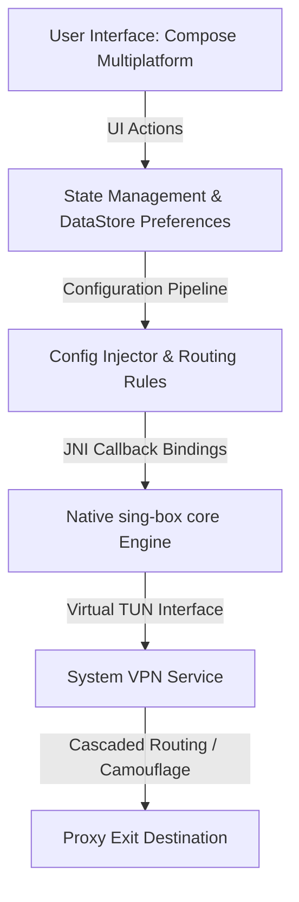

# Chameleon

[](#technical-specifications)
[](https://github.com/SagerNet/sing-box)
[](#-material-3-expressive-ui)
[](LICENSE)

Chameleon is a secure, high-performance, and visually expressive VPN client for Android and Desktop. Built from the ground up utilizing **Jetpack Compose** and **Material Design 3**, Chameleon pairs premium, dynamic aesthetics with robust, multi-protocol routing capabilities powered by the native `sing-box` connection engine.

---

## Architecture Overview

Chameleon is structured to provide consistent routing logic across mobile and desktop interfaces by packaging the `sing-box` core engine natively.



---

## Key Capabilities

### 🎨 Material 3 Expressive UI & Micro-Animations
* **Asymmetric Corner Design**: Implements fluid, organic rounded shapes (`ExpressiveCardShape`, `ExpressiveButtonShape`) for dashboard components and overlays, adhering to modern Material 3 design directives.
* **GPU-Accelerated Visualizations**: Features a real-time, canvas-based wave visualizer and custom-rendered progress indicators (`CircularWavyProgressIndicator`) running on the GPU drawing phase to eliminate CPU overhead.
* **Live Bandwidth Speeds**: Embedded rolling speed graph plotting download and upload speed history on a smooth cubic-bezier wave canvas.
* **Dynamic Color Accent Sync**: Layouts dynamically adapt their color scheme to match system Monet themes (Material You) or custom selected accent palettes.

### ⛓️ Multi-Hop Cascading Proxy Chains
* **Visual Chain Builder**: Create and edit proxy chains visually via a dynamic composition builder with circular-routing prevention.
* **Double-Hop Relaying**: Encrypt and route your traffic through a chain of two proxy servers (Device ➔ Relay Server ➔ Exit Destination ➔ Internet).
* **Native Outbound Routing**: Configured utilizing sing-box's native outbound `"detour"` parameters for zero overhead.

### 🕵️ Stealth Camouflage (Domain Fronting & IP Scanner)
* **Masquerading & SNI Fronting**: Bypasses SNI-based deep-packet inspection (DPI) by wrapping traffic under whitelisted domains and replacing target IP addresses with clean CDN endpoints.
* **Parallel Clean IP Scanner**: Employs an asynchronous, concurrent TCP prober (`CdnIpScanner`) with active socket validation to discover the fastest unblocked CDN edge IPs in real-time.
* **Presets & Custom Headers**: Built-in presets for major cloud providers alongside customizable Host header rewrites.

### ⚡ Smart Routing & DNS Protection
* **Bypass LAN Traffic**: Optional bypass for local area networks (e.g., `192.168.x.x`, `10.x.x.x`), keeping local printer and router connections direct.
* **Automated Direct Routing**: Built-in rules for automatic identification of domestic IP ranges and domains, routing them directly for maximum local speeds.
* **DNS Hijacking Mitigation**: Parallel secure DNS pre-resolver injecting validated IPs directly into connection configurations to bypass carrier DNS poisoning.

---

## Technical Specifications

| Parameter | Android App | Desktop App |
|:---|:---|:---|
| **OS Requirement** | Android 7.0+ (API Level 24+) | JVM Desktop (Windows / macOS / Linux) |
| **Target SDK** | Android 16 (API Level 36) | Java Runtime 17+ |
| **Language Toolchain** | Kotlin 2.x, Java 17 | Kotlin 2.x, Java 17 |
| **UI Toolkit** | Jetpack Compose | Compose for Desktop |
| **Connection Engine** | sing-box JNI Wrapper | native sing-box JNI binary |

---

## Getting Started

### Prerequisites

* Android Studio (Ladybug or newer)
* Android SDK (API 34+)
* JDK 17+
* Gradle 8.x+

### Building and Installation

1. **Clone the Repository**:
   ```bash
   git clone https://github.com/Rabkaps/Chameleon.git
   cd Chameleon
   ```

2. **Assemble Debug Build**:
   ```bash
   ./gradlew assembleDebug
   ```

3. **Install on Connected Device**:
   ```bash
   ./gradlew installStandardDebug
   ```

### ⚠️ Development Installation Warnings

Because Chameleon requests sensitive permissions (such as native Android `VpnService` tunnels) to route device traffic, self-signed/debug builds will trigger Google Play Protect warnings:

* **Why it occurs**: Local builds are signed with a generic, automatically-generated debug keystore rather than a registered Play Store signature.
* **How to proceed**:
  1. In the Play Protect popup, tap **"More details"**.
  2. Click **"Install anyway"** to complete the installation.
