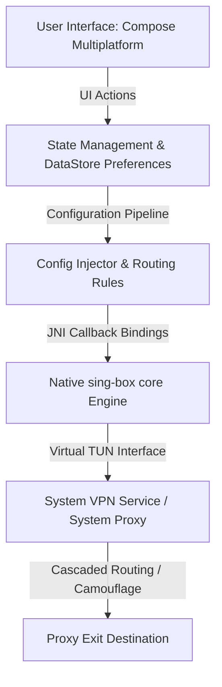

# Chameleon

[](#technical-specifications)
[](https://github.com/SagerNet/sing-box)
[](#key-capabilities)
[](LICENSE)

Chameleon is a secure, high-performance, and visually expressive cross-platform VPN client designed for Android and JVM Desktop. Utilizing **Jetpack Compose** and **Compose Multiplatform**, Chameleon combines a premium Material Design 3 interface with robust, low-latency, multi-protocol routing capabilities powered by the native `sing-box` connection engine via JNI bindings.

---

## Architecture Overview

Chameleon achieves unified routing logic and configuration pipelines across Android and JVM Desktop platforms by embedding the native Go-based `sing-box` core engine.



* **UI Layer**: Built with Compose Multiplatform to share layouts, themes, and UI states between Android and Desktop modules, with platform-specific hooks for native features (like Android Quick Settings Tiles and Desktop Tray integration).
* **Configuration Pipeline**: Translates user selections and proxy subscription details into valid `sing-box` JSON schemas, injecting user preferences on the fly.
* **Core Engine**: Packages a native Go library compiled as a JNI binary, allowing direct memory-based API calls instead of running subprocesses, which ensures high performance and reliable lifecycle management.

---

## Key Capabilities

### 🎨 Material 3 Expressive UI & Micro-Animations
* **Asymmetric Design Language**: Implements organic rounded card and button contours (`ExpressiveCardShape`, `ExpressiveButtonShape`) for the dashboard interfaces, conforming to modern Material 3 design directives.
* **GPU-Accelerated Visualizations**: Features a canvas-based wave visualizer and custom wavy progress indicators (`CircularWavyProgressIndicator`) running entirely on the GPU draw phase to eliminate CPU overhead.
* **Live Bandwidth Speeds**: Rolling speed graph plotting download and upload speed history in real-time over a smooth cubic-bezier wave canvas.
* **Dynamic Color Accent Sync**: Adapts color schemes dynamically to match system Monet themes (Material You) on Android or custom selected accent palettes on JVM Desktop.

### ⛓️ Multi-Hop Cascading Proxy Chains
* **Visual Chain Builder**: Create and edit proxy chains visually via a dynamic composition builder with circular-routing prevention.
* **Double-Hop Relaying**: Encrypt and route your traffic through a chain of two proxy servers (Device ➔ Relay Server ➔ Exit Destination ➔ Internet) to conceal your originating IP address from the destination.
* **Native Outbound Routing**: Configures the multi-hop paths natively inside the `sing-box` core utilizing outbound `"detour"` parameters for zero performance overhead.

### 🕵️ Stealth Camouflage (Domain Fronting & IP Scanner)
* **Masquerading & SNI Fronting**: Bypasses SNI-based deep-packet inspection (DPI) by wrapping traffic under whitelisted domains and replacing target IP addresses with clean CDN endpoints.
* **Parallel Clean IP Scanner**: Employs an asynchronous, concurrent TCP prober (`CdnIpScanner`) with active socket validation to discover the fastest unblocked CDN edge IPs in real-time.
* **Cloud Presets**: Built-in presets for major cloud providers alongside customizable Host header rewrites.

### ⚡ Smart Routing & DNS Protection
* **Bypass LAN Traffic**: Keep local area networks (e.g., `192.168.x.x`, `10.x.x.x`) direct, preserving local printer and network storage connectivity.
* **Automated Direct Routing**: Built-in rules for automatic identification of domestic IP ranges and domains, routing them directly for maximum local speeds.
* **DNS Hijacking Mitigation**: A parallel secure DNS pre-resolver that injects validated IPs directly into connection configurations to bypass carrier-level DNS poisoning.

---

## Directory Structure

```
Chameleon/
├── app/                  # Android application module (Jetpack Compose, Android VpnService wrapper)
│   └── src/
│       └── main/
│           ├── java/     # Kotlin source code (MainActivity, VpnServiceWrapper, UI modules)
│           └── res/      # Android application resources
├── desktop/              # JVM Desktop application module (Compose for Desktop, System Proxy)
│   └── src/
│       └── desktopMain/  # Desktop Kotlin source code (Main, UI, CdnIpScanner, Desktop Window)
├── gradle/               # Gradle wrapper and build configuration dependency catalog
└── build.gradle.kts      # Project root Gradle build configuration
```

---

## Technical Specifications

| Parameter | Android App | Desktop App |
|:---|:---|:---|
| **OS Requirement** | Android 7.0+ (API Level 24+) | JVM Desktop (Windows / macOS / Linux) |
| **Target SDK** | Android 16 (API Level 36) | Java Runtime 17+ |
| **Language Toolchain** | Kotlin 2.x, Java 17 | Kotlin 2.x, Java 17 |
| **UI Toolkit** | Jetpack Compose | Compose for Desktop |
| **Connection Engine** | `sing-box` JNI Wrapper | Native `sing-box` JNI binary |

---

## Getting Started

### Prerequisites

* **Android Studio** (Ladybug or newer)
* **Android SDK** (API 34+ / SDK 36 targeting)
* **JDK 17** (or newer)
* **Gradle 8.x** (or newer)

### Building from Source

1. **Clone the Repository**:
   ```bash
   git clone https://github.com/Rabkaps/Chameleon.git
   cd Chameleon
   ```

2. **Assemble Android Debug Build**:
   ```bash
   ./gradlew :app:assembleDebug
   ```

3. **Install Android Debug Build on Connected Device**:
   ```bash
   ./gradlew :app:installStandardDebug
   ```

4. **Run JVM Desktop Client**:
   ```bash
   ./gradlew :desktop:run
   ```

5. **Package JVM Desktop Client**:
   ```bash
   ./gradlew :desktop:package
   ```

---

## Development Installation Warnings (Android)

Because Chameleon requests sensitive permissions (such as native Android `VpnService` tunnels) to route device traffic, self-signed/debug builds will trigger Google Play Protect warnings:

* **Why it occurs**: Local builds are signed with a generic, automatically-generated debug keystore rather than a registered Play Store signature.
* **How to proceed**:
  1. In the Play Protect popup, tap **"More details"**.
  2. Click **"Install anyway"** to complete the installation.

---

## License

This project is licensed under the GPL v3 License. See the [LICENSE](LICENSE) file for more information.
